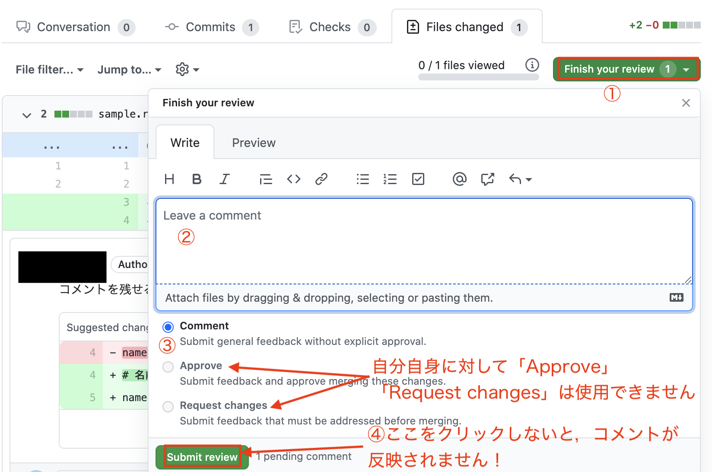

`Git`, `GitHub` の記事は世の中にたくさんありますが，「初学者」にとっては難しいものが多い印象です。

そこで `Git` をインストールすらしていない「Git初学者」を想定し，解説はあえて最小限度に止め，基本的な使い方を「手を動かしながら体感していただく」ことを意識してまとめました。

環境は macOS であることを前提とさせていただきます。

## 0. はじめに

### 0.1 Gitとは

`Git` は、プログラムのソースコードなどを，いつ，誰が，どのように編集したかを記録・追跡するための「バージョン管理システム」です。

### 0.2 GitHubとは

`GitHub` は `Git` をオンライン上で管理するホスティングサービスの内の1つです。 `GitHub` を利用することで，遠く離れた開発者同士でも効率よく開発を進めることができます。

### 0.3 準備

`ターミナル` に慣れていない方は，先に `Progate` で基本操作を学習されることをお勧めします。無料で学習できます。

- [【Progate】Command Line](https://prog-8.com/languages/commandline)

### 0.4 Gitのインストール・GitHubの新規登録

`Git` の環境構築と，`GitHub` の新規アカウント登録がまだの方は，基本的に以下を参考にして下さい。

- [【Mac】Gitの環境構築をしよう！](https://prog-8.com/docs/git-env)

2021年8月13日よりパスワード認証が廃止されます。手間がかかりますが，「Githubアカウントの新規登録直後」のタイミングで，以下を参考に2段階認証設定も行いましょう。

- [GitHubを使おう! ログイン方法や2段階認証設定を徹底解説](https://www.sejuku.net/blog/70914)
  - 「Security」タブは現在「Account security」タブに変更されています

Progate の最後に出てくるコマンド `git push origin master` は実行せず，代わりに `git push origin HEAD` を実行して下さい。

なお，`git push origin HEAD` を実行した際に，初回のみ，「ユーザー名」と「パスワード」を求められます。

「ユーザー名」は `GitHub` のユーザー名を入力してEnterキーを押し，「パスワード」は以下の方法で取得できる `personal access token` をコピペしてEnterキーを押して下さい。なお，パスワード入力時に何も表示されませんが，これは仕様です。

- [【GitHub】Creating a personal access token](https://docs.github.com/en/free-pro-team@latest/github/authenticating-to-github/creating-a-personal-access-token)
  - `Creating a token` の箇所の 1 ~ 10 の操作で `personal access token` を入手できます

### 0.5 追加すべき初期設定

ターミナルから以下のコマンドを実行して下さい。

- `git pull` 実行時の merge の挙動を決める設定（過去のデフォルト値）

```
git config --global pull.rebase false
```

- グローバルな `.gitignore` を `~/.gitignore_global` とし，`Git` で管理すべきでないファイルが混入しないようにする設定

```
touch ~/.gitignore_global
git config --global core.excludesfile ~/.gitignore_global
open ~/.gitignore_global
```

テキストエディタなどで `.gitignore_global` が開かれます。

ブラウザで [gitignore.io](https://www.toptal.com/developers/gitignore) にアクセスし，「mac」と入力して「macOS」を選択し「Create」ボタンを押すと， `Git` で管理すべきでないファイル一覧が表示されます。

表示された内容を全てコピーし，この `.gitignore_global` に貼り付けて保存して下さい。

これで最低限度の環境構築は完了です。

### 1. 基本操作

はじめに，最重要コマンドである `add`, `commit`, `push` について手を動かしながら体験してきましょう。

#### 1.1 ローカルリポジトリの作成

まず，Git練習用のディレクトリを作成しましょう。

ターミナルから，以下のコマンドを実行して下さい。

```
cd ~/Desktop
mkdir git_practice
cd git_practice
```

Gitを利用するには，まず「ローカルリポジトリ」を作成する必要があります。以下のコマンドを実行しましょう。

```
git init
```

【注意】 `git init` コマンドは，「Git で管理したいディレクトリに cd コマンドで移動してから」実行しましょう。絶対にホームディレクトリで実行しないようにして下さい。

#### 1.2 コミット

`git_practice` ディレクトリに `sample.rb` を作成し，これを利用して `コミット` などを練習していきましょう。

まず，ターミナルから以下を実行して下さい。

```
vi sample.rb
```

`Vim` エディタが起動しますので，以下を入力して保存終了しましょう。

```rb
msg = "Hello World!"
```

---

【参考】Vimエディタの使い方について

練習を兼ねて `Vim（ヴィム）` で入力することをお勧めします。`Vim` はターミナルで使用できるテキストエディタの 1 つです。

一般のテキストエディタは，ファイルを開いてすぐに文字入力できますが，`Vim` は「インサートモード」に変更しなければキー入力ができません。ここが初学者が混乱しやすいところです。

以下の 6 つさえ覚えておけば，今回の練習では支障がないでしょう。

- Vim の起動時は「ノーマルモード」
- 文字をキー入力したいときは「インサートモード」に移行する必要がある
- 「インサートモード」への移行は，（英数入力にした上で） `i` キー
- 保存終了するには「ノーマルモード」に移行する必要がある
- 「ノーマルモード」への移行は，`esc` キー
- 「保存終了」するには「ノーマルモード」へ移行した上で，shiftキーを押しながら `z` キーを2回

---

これで `sample.rb` を作成できました。念のため，ターミナルから以下のコマンドを実行して内容を確認して下さい。

```
cat sample.rb
```

`msg = "Hello World!"` が表示されればOKです。

現在の `sample.rb` をGitで保存したい場合は，`add`, `commit` の2つの操作を行います。ターミナルから以下のコマンドを実行して下さい。

```
git add .
git commit -m "変数 msg を定義"
```

`git add .` コマンドでローカルリポジトリを作成した `git_practice` ディレクトリの全てのファイル・ディレクトリを「保存の対象」にします。

そして， `git commit -m "コミットメッセージ"` コマンドを実行することで，メッセージ付きで「保存」できます。（Gitでは `コミット` といいます）

#### 1.3 status, diff, log

`sample.rb` に追記してみましょう。ターミナルから次を実行し，再度 `Vim` エディタで開いて下さい。

```
vi sample.rb
```

以下の2行目を追記して保存終了しましょう。

```rb
msg = "Hello World!"
puts msg
```

さて，`add`, `commit` を行う前に，Gitの操作で重要な2つのコマンド `git status`, `git diff` について簡単に確認しておきましょう。

まずターミナルから以下を実行して下さい，

```
git status
```

いろいろ表示されますが，赤文字の `modified:   sample.rb` が重要です。これは，前回のコミット(commit)から `sample.rb` が変更されていることを表しています。

`git status` を実行することで，前回のコミットから「どのファイルを変更・追加・削除したか」などを確かめることができます。想定外の変更がコミットに混じらないようにするため，原則として，`add`, `commit` を行う前に必ず `git status` を実行して確認することをお勧めします。

次に，ターミナルから以下を実行して下さい。

```
git diff
```

`+puts msg` が緑文字で表示されますが，これは前回のコミットから「緑文字」のコードを「追加」したことを表しています。「削除」されたコードは「赤文字」で表示されます。

`git diff` コマンドを実行することで，前回のコミットからどのような変更を行ったかを確かめることができるわけです。

想定外の変更がコミットに混じらないようにするため，`add`, `commit` を行う前に `git diff` も実行して確認することをお勧めします。

それでは，`add`, `commit` を行いましょう。ターミナルから以下を実行して下さい。

```
git add .
git commit -m "変数 msg の出力操作を追加"
```

ここでターミナルから以下を実行しましょう。

```
git log
```

これまでの2つのコミットメッセージ「変数 msg を定義」「変数 msg の出力操作を追加」が表示されるはずです。`git log` を実行すると， `コミット履歴` を確認することができます。

なお， `git log --oneline` を実行すれば，各コミットが1行で表示されますので，コミット履歴の確認はこちらのコマンドをお勧めします。

【補足】 `git log` 実行時に `lines 1-6` のようなものが表示された場合は，（英数入力にした上で） `q` キーを押せば表示が戻ります。

### 1.4 最新のコミットの状態に戻す

「コードを編集していたら突然エラーが出るようになり，原因も分からない……」

コミットをしておけば，このような場合にコードを戻すことができます。例として，最新のコミットの状態に戻す方法を確認しておきましょう。

ターミナルから次を実行し， `Vim` エディタで開いて下さい。

```
vi sample.rb
```

自由に追記・編集をし，保存終了して下さい。その後，ターミナルから以下を実行し，差分を確認しておきましょう。

```
git diff
```

その上で，次を実行して下さい。

```
git restore sample.rb
git diff
```

`git diff` コマンドで何も表示されなくなったはずです。つまり，ファイルの中身が元に戻っていることになります。

`git restore ファイル名`（もしくは `git checkout -- ファイル名`） コマンドで，指定したファイルを最新のコミットの状態に戻すことができます。

【補足】「変更内容を破棄せず一応残しておきたい」という場合は `stash` コマンドを利用して下さい。`git stash -u` で全ての差分を一時待避して，最新のコミットの状態に戻せます。`git stash pop` もしくは `git stash apply` で退避した内容を再度反映できます。

#### 1.5 プッシュ

現在のローカルリポジトリの変更履歴を `GitHub` に共有しましょう。

まず，GitHub([https://github.com/](https://github.com/))にアクセスし，「新規リポジトリ」を作成して下さい。

右上の「＋」ボタンをクリックし，「New repository」をクリックしましょう。


「Repository name」に「git_practice」と入力し，「Create repository」ボタンをクリックして下さい。

（同名のリポジトリが存在する場合は，他の名前を変更して下さい）


「HTTPS」が選択されていることを確認した上で，URLをコピーして下さい。


そして，先ほどのターミナルで以下を実行して下さい。

```
git remote add origin コピーしたURL
git push origin HEAD
```

これで，現在の「ローカルリポジトリ」の変更履歴が `GitHub` に共有されます。

ブラウザをリロードして下さい。`sample.rb` が表示されるでしょう。 `sample.rb` をクリックすると，ファイルの中身を確認できます。

ブラウザバックし， `2 commits` をクリックしましょう。「add introduce」などのコミット履歴を確認できます。


このように `git push リモート名 HEAD` コマンドを実行することで，PC上の「ローカルリポジトリ」を，GitHubの「リモートリポジトリ」に共有することができます。

ただし，初回のみ，「どこにプッシュするか」，言い換えれば，「リモート名」を登録しなければなりません。

「リモート名 origin」に，プッシュ先である「リモートリポジトリのURL」を登録するコマンドが `git remote add リモート名 リモートリポジトリのURL` です。「リモート名」は通常 `origin` を使用します。

【補足】プッシュのコマンドとして `git push origin master` をよく見かけますが，必要となるケースは0に近い上に事故が起こる元凶です。本日をもって忘れて下さい。プッシュするコマンドは `git push origin HEAD` で覚えておきましょう。

#### 1.6 クローン

`GitHub` にプッシュした「リモートリポジトリ」は PC 内にコピー（`クローン`）できます。

これを確かめるため，先ほど作成した PC 内の `git_practice` ディレクトリを一旦削除し， `クローン` で復帰させてみましょう。

ターミナルで以下を実行し， `git_practice` ディレクトリを削除して下さい。

```
cd ~/Desktop
rm -rf git_practice
```

リモートリポジトリのURLをコピーし，ターミナルから次のコマンドを実行しましょう。

```
git clone コピーしたURL
```


次のような表示が出て，100%になればOKです。

```
Cloning into 'git_practice'...
remote: Enumerating objects: 6, done.
remote: Counting objects: 100% (6/6), done.
remote: Compressing objects: 100% (2/2), done.
remote: Total 6 (delta 0), reused 6 (delta 0), pack-reused 0
Receiving objects: 100% (6/6), done.
```

ターミナルで以下を実行し，ファイルの中身を確認してみましょう。

```
cd git_practice
cat sample.rb
```

以下が表示されればOKです。

```rb
msg = "Hello World!"
puts msg
```

このように `git clone` コマンドで，`GitHub` からリポジトリをコピーできます。

複数人での開発では，最初に1人がベースコードをプッシュし，他のメンバーはクローンして作業を進めることになります。

### 1.7 コミットメッセージの修正

次に，コミットする際にコミットメッセージを間違えてしまった場合の対処方法を確認しましょう。

まず，現在のコミットメッセージを確認しましょう。ターミナルから次を実行して下さい。

```
git log --oneline
```

出力例

```
ebdc466 (HEAD -> master, origin/master, origin/HEAD) 変数 msg の出力操作を追加
52d63e0 変数 msg を定義
```

最新のコミットメッセージを修正したい場合は，`--amend` オプションを使用します。

ターミナルから次を実行してみましょう。

```
git commit --amend -m "add 'puts msg'"
git log --oneline
```

出力例

```
b391371 (HEAD -> master) add 'puts msg'
52d63e0 変数 msg を定義
```

このように `git commit --amend -m "新しいコミットメッセージ"` コマンドで，最新のコミットメッセージを変更できます。

【補足】以前のコミットメッセージを変更するには `git rebase -i コミットID` を使用します。少し手間がかかりますので省略します

### 1.8 強制プッシュ

さて，ここでGitHubに再度プッシュしてみましょう。ターミナルから以下を実行して下さい。

```
git push origin HEAD
```

次のようなエラーが出るはずです。

```
 ! [rejected]        HEAD -> master (non-fast-forward)
error: failed to push some refs to 'https://github.com/ユーザー名/git_practice.git'
hint: Updates were rejected because the tip of your current branch is behind
hint: its remote counterpart. Integrate the remote changes (e.g.
hint: 'git pull ...') before pushing again.
hint: See the 'Note about fast-forwards' in 'git push --help' for details.
```

コミット履歴が変更された状態で `GitHub` にプッシュしますと，このように拒否されてしまいます。

もし，現在のコミット履歴を「強制的に」 `GitHub` にプッシュしたい場合は， `-f` オプションが必要となります。ターミナルから以下を実行して下さい。

```
git push -f origin HEAD
```

今度はプッシュに成功するはずです。ブラウザで `2 commits` の箇所をクリックすれば，最新のコミットメッセージが「add 'puts msg'」に変更されているはずです。

【注意】強制プッシュが禁止されている開発現場もあります。その場合は，GitHubにプッシュした履歴を絶対に変更しないようにしましょう。

### 2. 共同開発の流れ

`Git`, `GitHub` を利用して複数人で同時開発する場合は，以下の手順で行います。

1. 「デフォルトブランチ」から `ブランチ` を切る
2. 作業を行う（コミットを含む）
3. GitHubにプッシュ
4. GitHubから `プルリクエスト（プルリク）` を出す
5. チームメンバーに Slack などでレビュー依頼を出す
6. 「Comment」「Request changes」コメントをもらった場合は，修正してコミットし，再度GitHubにプッシュし，レビュー依頼を出す
7. 「Approve」コメントをもらったら，「Merge pull request」ボタンを押し，GitHubの「デフォルトブランチ」に `マージ` する
8. ローカルで「デフォルトブランチ」に移動し，プルする

初めての方は「難しそう……」と思われるかもしれませんが，現場では呼吸をするが如くできることを求められます。

#### 2.1 デフォルトブランチの確認

ターミナルから以下を実行して下さい。

```
git branch
```

`* master` もしくは `* main` が表示されるはずですが，表示されたものが「デフォルトブランチ」です。

まず，「デフォルトブランチ」が `master` か `main` のどちらであるかを把握しておいて下さい。

【注意】以前までは「デフォルトブランチ」は `master` だったのですが，最近 `main` に変更されつつあります。現在，Git に関する記事のほとんどは `master` の前提です。 `main` の場合は読み替える必要がありますのでご注意下さい。

【補足】ブランチ名をターミナルに常時表示することも可能です。設定されたい方は検索して下さい。ただし，`echo $SHELL` を実行して `bash` か `zsh` かを確認し，対応する方の設定を行う必要があります。

#### 2.2 ブランチを切る必要性

複数人での開発を行う場合，「デフォルトブランチ」で作業をしてはいけませんし，プッシュしてはいけません。

例えば，「デフォルトブランチ」を `main` とし，`A`, `B`, `C` というコミットがあったとします。

```
main: A -> B -> C
```

ここで，「太郎くん」と「花子さん」の2人が `コミットC` からスタートし，`main` ブランチで別々の作業を行ってコミットをしたとしましょう。

```
【太郎くん】main: A -> B -> C -> D -> E
【花子さん】main: A -> B -> C -> D' -> E'
```

このように，コミット履歴が違ってしまいます。「太郎くん」が `GitHub` にプッシュした後，「花子さん」がプッシュしたらエラーになります。強制プッシュしたら「太郎くん」の作業が消えてしまいます。

そのため，共同開発を行う場合は，「ブランチを切ってから」作業を行い，コミットをしなければなりません。

例えば，「太郎くん」が `feature/hoge` ブランチを切り，「花子さん」が `feature/fuga` ブランチを切ったとします。

```
【太郎くん】feature/hoge: D -> E
                     /
    main: A -> B -> C
                     \
【花子さん】feature/fuga: D' -> E'
```

このようにブランチを切っておくと，2人が `GitHub` にプッシュしても衝突しません。この後説明する `プルリク`, `マージ` の手順を踏むことで，両方の作業を `main` ブランチに統合できるのです。

#### 2.3 リポジトリの初期設定

複数人で開発する場合に最低限行っておくべきリポジトリの設定を確認しておきます。

まず，GitHubのブランチをマージした直後に，マージされたブランチを削除する設定をしましょう。

- GitHub の「Settings」タブを開き，「Automatically delete head branches」にチェックを入れる 


次に，「デフォルトブランチ」にプロテクトをかけましょう。

- 左上の「Branches」タブを開き，「Add rule」ボタンをクリックし，「Branch name pattern」に「デフォルトブランチ名」を入力して「Create」ボタンをクリック


これで，以下の操作を拒否できます。

- 「デフォルトブランチ」のコミット履歴を変更する
- 「デフォルトブランチ」を削除する

---

【参考】

今回は一人での練習を想定していますので設定を避けましたが，「Require pull request reviews before merging」と「Include administrators」にチェックを入れておきますと，次の操作も拒否できます。（一人で練習される場合はチェックを入れないで下さい）

- 「デフォルトブランチ」にプッシュ
- `Approve` コメント無しで「デフォルトブランチ」にマージ

なお，一般には `master(main)` は「リリース用のブランチ」とし，ここから「開発ブランチ」である `develop` を切り， `develop` を「デフォルトブランチ」にしますが，今回は省略します。

---

#### 2.4 共同開発の流れ

それでは，手を動かしながら一連の流れを確認していきましょう。

##### 2.4.1 「デフォルトブランチ」から `ブランチ` を切る

開発用にブランチを切るときは，原則として「デフォルトブランチ」から切らなければなりません。初回なので今回は不要ですが，念のため確認しましょう。ターミナルから次をコマンドを実行して下さい。

```
git branch
```

`*` が付いているブランチが「現在の」ブランチです。「デフォルトブランチ」に `*` が付いていることを確認した上でブランチを切るようにしましょう。

ブランチを切るには `git switch -c ブランチ名` （もしくは `git checkout -b ブランチ名`）を使用します。ターミナルから次をコマンドを実行して下さい。

```
git switch -c feature/get-name
```

現在のブランチを変更できているかを確認するため，ターミナルから次をコマンドを実行して下さい。

```
git branch
```

`feature/get-name` に `*` が付いていればOKです。

【補足】ブランチ名を間違えた場合は `git branch -m 新しいブランチ名` コマンドを使用して下さい。

【参考】ブランチ名を `feature/~~~` の形式にしていますが，気になる方は `Git-flow` で検索して下さい。

##### 2.4.2 作業を行う

ターミナルから次を実行し， `Vim` エディタで開いて下さい。

```
vi sample.rb
```

以下の3行目以降を追記しましょう。

```rb
msg = "Hello World!"
puts msg

name = gets.chomp
```

ターミナルから以下を実行しましょう。

```
git status
git diff
git add .
git commit -m "名前の入力を求める操作を追加"
```

##### 2.4.3 GitHubにプッシュ

ターミナルから次を実行しましょう。現在のブランチを `GitHub` にプッシュできます。

```
git push origin HEAD
```

ブラウザから `GitHub` のリポジトリにアクセスして下さい。（URLが分からない場合は，プッシュ時に表示される `To リポジトリのURL` を参考にしましょう）

そのまま `sample.rb` をクリックすると，ブランチを切る前の2行分しか表示されません。これは「デフォルトブランチ」のファイルだからです。

先ほどプッシュしたのは `feature/get-name` ブランチです。次の画像の手順で，表示内容を `feature/get-name` ブランチに変更しましょう。


再度 `sample.rb` をクリックすると，今度はブランチを切った後にコミットしたコードが反映されているはずです。

##### 2.4.4 プルリク

ブラウザバックしてリポジトリのトップページを確認しますと，黄色のフラッシュが表示されているはずです。

ここから `プルリクエスト`(略して `プルリク`) を出すことができます。

「Compare & pull request」ボタンをクリックしましょう。


通常は，close する issue を記載し，作業概要などを comment 欄に記載し，Reviewers を設定したりしますが，今回は comment だけ加えて「Create pull request」ボタンをクリックすることにしましょう。（comment の内容は自由です）

```
## 内容

- `gets` コマンドを使用してユーザーが `名前` を入力できるようにコードを追加
  - `chomp` メソッドを使うことで改行 `\n` を除去
```


`comment` は `マークダウン形式` に対応しています。「見出し」「リスト」「テーブル」「チェックボックス」などを活用されるとよいでしょう。具体的な書き方は，以下の公式ドキュメントなどを参考にして下さい。

[【GitHub】基本的な書き方とフォーマットの構文](https://docs.github.com/ja/free-pro-team@latest/github/writing-on-github/basic-writing-and-formatting-syntax)

##### 2.4.5 レビュー依頼

プルリクを出したあとは，チームメンバーに `Slack` などでレビュー依頼を行います。

さて，他人にレビュー依頼を出す前に必ずすべきことがあります。それは，

「自分自身でレビューをすること」

です。

`Files changed` タブを開きましょう。


ブランチを切った後の全ての差分を確認できます。

- 適切にフォーマットできているか
- 無駄な改行や空白スペースがないか
- 無駄なコメントアウトを残していないか
- 無駄なコードを残していないか
- より分かりやすいコードが書けないか

など，まずは自分自身でレビューを行いましょう。その上で他人にレビュー依頼を出すべきです。

差分を確認すればすぐに分かることを放置してレビュー依頼を出していたら，どんどん信頼されなくなり，相手にされなくなるでしょう。

（以下は読むだけでOKです）

プルリクのレビューをするときは，主に「Files changed」から行います。図のように，コードの各行に対応するコメントを書いたり，「このようにリファクタリングできる」など，コードの提案ができます。


コメントを書いた後は，「Finish your review」をクリックし，「Submit review」ボタンをクリックしないとコメントが反映されませんのでご注意下さい。



なお，レビュー方法は3種類用意されています。（自分自身に対しては「Comment」しか使えません）

Review changes | 説明
--- | ---
Comment | コメントのみ
Approve | プルリクを承認
Request changes | 修正を要求

詳しくはこちらをご覧下さい。

- [【GitHub】プルリクエストのレビューについて](https://docs.github.com/ja/free-pro-team@latest/github/collaborating-with-issues-and-pull-requests/about-pull-request-reviews)

【補足】 `2.3` における設定次第では，この `Approve` コメントが指定数以上ないと後に説明するマージができません

##### 2.4.6 「Comment」「Request changes」コメントをもらったとき

「Request changes」コメントなどで修正を要求された場合は，必要な修正を行い，`add`, `commit`, `push` を行いましょう。

改めてプルリクを出し直す必要はありません。プッシュするだけで現在のプルリクに反映されます。

##### 2.4.7 GitHubでマージ

GitHubの `feature/get-name` ブランチを「デフォルトブランチ」に統合（`マージ`）してみましょう。

「Conversation」タブをクリックし，下の方に「Merge pull request」ボタンをクリックし，「Confirm merge」ボタンをクリックして下さい。


マージが完了したら，リポジトリ名の箇所をクリックしてトップページに移動し，本当に統合されているか確認しましょう。


「デフォルトブランチ」を表示していることを確認し， `sample.rb` をクリックして下さい。

先ほどはブランチを切る前の状態（2行のみ）でしたが， `feature/get-name` ブランチをマージしたことで4行のコードになっているはずです。

また，コミットの回数も `4 commits` に変化しています。（`マージコミット` によりコミットの回数が1つ増えています）

【補足】「Merge pull request」ボタンにドロップダウンがありますが，ここで統合する方法を3種類指定できます。詳しくは以下の公式ドキュメントなどを参考にして下さい

[【GitHub】プルリクエストをマージする](https://docs.github.com/ja/free-pro-team@latest/github/collaborating-with-issues-and-pull-requests/merging-a-pull-request)

##### 2.4.8 ローカルで「デフォルトブランチ」に移動し，プルする

さて，ここでローカル（PC側）の「デフォルトブランチ」を確認してみましょう。

ブランチを（作成せずに）切り替えるだけの場合は `git switch ブランチ名` (もしくは `git checkout ブランチ名`)コマンドを使用します。

ターミナルから次を実行して下さい。

```
git switch デフォルトブランチ名 
# git branch で デフォルトブランチ にいることを確認
```

（「デフォルトブランチ名」は `master` か `main` のいずれかです。忘れてしまった場合は `git branch` で確認しましょう）

「デフォルトブランチ」に移動できていることを確認したら，`sample.rb` の中身を確認してみましょう。ターミナルから次を実行して下さい。

```
cat sample.rb
```

まだ2行のままですね。コミット履歴も確認してみましょう。

```
git log --oneline
```

コミットが2つのままですね。

`2.4.7` で「デフォルトブランチ」にマージしましたが， `GitHub` で行っただけで，ローカル（PC側）ではありません。

`GitHub` 上で操作しただけですので，当然ローカルには反映されていないのです。

ローカルに `GitHub` の「デフォルトブランチ」の状態を反映させたい場合は `プル` しなければなりません。ターミナルから次を実行しましょう。

```
git pull origin HEAD
```

再度 `sample.rb` の中身を確認してみましょう。ターミナルから次を実行して下さい。

```
cat sample.rb
git log --oneline
```

コードが4行表示され，コミットも4つになっているはずです。

これで，共同開発における一連の流れを体験することができました！

### 3. コンフリクト

#### 3.1 コンフリクトとは

2章で，ブランチを切ることで複数人での同時開発が可能になると説明しましたが，1つ問題があります。

もし2人が，同じファイルの同じ行に別の変更を加えた場合はどうなるでしょう。例えば次のような例を考えます。

- 太郎くんの `sample.rb`

```rb
msg = "Hello World!"
puts msg

name = gets.chomp
# 次を追加
puts "私の名前は#{name}です。"
```

- 花子さんの `sample.rb`

```rb
msg = "Hello World!"
puts msg

name = gets.chomp
# 次を追加
puts "My name is #{name}."
```

この状態で「太郎さん」と「花子さん」がプッシュしてプルリクを出し，マージしようとしたとしましょう。次の問題が起こります。

- 「太郎さん」と「花子さん」の両方のコードを残すのか，片方だけ残すのか
- 両方残すなら，どちらを上にするのか
- 片方残すなら，どちらを残すのか

このように，自動的に追加・編集・削除を統合できない場合は，競合（`コンフリクト`）が起こります。

1人で開発していると通常は起こらないので，コンフリクトが起きると対応に戸惑う方が少なくありません。

そこで，上記のコンフリクトを意図的に起こし，対処方法を体験していただくことにしましょう。

#### 3.2 太郎くんの変更

まず，「太郎くん」になったつもりでブランチを切り，コミット・プッシュ・プルリク・マージまでの作業を行いましょう。

一連の流れは2章で解説済みですので，細かい解説は省略します。

ターミナルから以下を実行して下さい。

```
# git branch で デフォルトブランチ にいることを確認
git switch -c feature/taro
# git branch で feature/taro ブランチにいることを確認
vi sample.rb
```

（分かりやすいように，ブランチ名はあえて人名にしています）

`Vim` エディタが起動しますので，最後の行(5行目)に次を入力して保存終了しましょう。

```rb
puts "私の名前は#{name}です。"
```

ターミナルから以下を実行して下さい。

```
git status
git diff
git add .
git commit -m "挨拶を追加"
git push origin HEAD
```

ブラウザでGitHubリポジトリのトップページにアクセスし，プルリクを出し，マージして下さい。（コメントは無しでOKです）

#### 3.3 花子さんの変更

次に，「花子さん」になったつもりでブランチを切り，コミット・プッシュ・プルリクまでの作業を行いましょう。

まず，「デフォルトブランチ」に移動して下さい。

```
git switch デフォルトブランチ名
# git branch で デフォルトブランチ にいることを確認
```

「デフォルトブランチ」への移動を確認した上で，ターミナルから以下を実行して下さい。

```
git switch -c feature/hanako
# git branch で feature/hanako ブランチにいることを確認
vi sample.rb
```

`Vim` エディタが起動しますので，最後の行(5行目)に次を入力して保存終了しましょう。

```rb
puts "My name is #{name}."
```

ターミナルから以下を実行して下さい。

```
git status
git diff
git add .
git commit -m "add greeting"
git push origin HEAD
```

ブラウザでGitHubリポジトリにアクセスし，プルリクを出して下さい。

さて，マージをしようとすると次の画像のようにマージができないはずです。


#### 3.4 ローカルでコンフリクトを起こす

コンフリクトを解消する方法は大きく2つあります。

- GitHubの「Resolove conflicts」ボタンを使い解消する
- ローカルでコンフリクトを解消してプッシュする

原則として前者はお勧めしません。2つの大きなデメリットがあるからです。 

- コンフリクト解消後に動作確認をしないので，問題が発生する要因となりやすい
- 簡易的なエディタ機能しか付いていないので，複雑なコンフリクトを解消するには効率が悪い

そこで，後者の「ローカルでコンフリクトを解消してプッシュする」方法で進めていきます。

まず，以下をターミナルから実行しましょう。

```
# git branch で feature/hanako ブランチにいることを確認
git fetch --prune
git merge origin/デフォルトブランチ名
```

（最後のコマンドは，「デフォルトブランチ名」が `master` ならば `git merge origin/master`，「デフォルトブランチ名」が `main` ならば `git merge origin/main` です）

最後のコマンドで次のように表示されるはずです。

```
Auto-merging sample.rb
CONFLICT (content): Merge conflict in sample.rb
Automatic merge failed; fix conflicts and then commit the result.
```

ローカルでコンフリクトを起こすことができました。

何を行ったかを簡単に説明します。

`git fetch` コマンドは，GitHubのブランチを全てローカルに取り込むコマンドです。具体的には `GitHub` の `main` ブランチが `origin/main` ブランチとしてローカルに取り込まれます。

（`--prune` オプションは，GitHubから削除されたリモートブランチを，ローカルでも削除するオプションです）

一方， `git merge ブランチ名` コマンドは，ローカルでマージを行うコマンドです。

`git merge origin/main` は，「太郎くん」の変更を反映した GitHub の `main` ブランチ（5行目に `puts "私の名前は#{name}です。"` が記載されている）を，「花子さん」のブランチにマージする操作になるわけです。

5行目を `puts "私の名前は#{name}です。"` にすべきか `puts "My name is #{name}."` にすべきか判定できないため，コンフリクトが起きたのです。

コンフリクトが起きたファイルは，マージした際に確認できますが，次のコマンドでも確認できます。

```
git status
```

`both modified:   sample.rb` が表示されますが，`both modified` が付いているファイルがコンフリクトを起こしています。

#### 3.5 コンフリクトを解消

さて，コンフリクトを解消しましょう。

今回は「各自の使用しているコードエディタ」を使用されることをお勧めします。`VSCode` の場合は，（設定を行っている前提で） `code .` を実行して下さい。

起動方法が分からない場合は `Vim` を使用して下さい。

```
vi sample.rb
```

`sample.rb` を開くと，次の状態になっているでしょう。

```
msg = "Hello World!"
puts msg

name = gets.chomp
<<<<<<< HEAD
puts "My name is #{name}."
=======
puts "私の名前は#{name}です。"
>>>>>>> origin/デフォルトブランチ名
```

`<<<<<<< HEAD`, `=======`, `>>>>>>> origin/デフォルトブランチ名` などが追加されていますが，これはコンフリクトが起きている箇所を表しています。

`<<<<<<< HEAD` と `=======` の間は，「現在の変更」，つまり「花子さんの変更」です。

`=======` と `>>>>>>> origin/デフォルトブランチ名` の間は，「`origin/デフォルトブランチ名` の変更」，つまり，現在の 「GitHub の デフォルトブランチ」の状態です。

要するに，`======` の「下側」が「現在の開発状況」，「上側」が「自分の変更内容」です。

コンフリクトを解消するときは，原則として， `=======` の「下側」を尊重しつつ，「上側」の自分の変更を反映させるようにしましょう。

（具体的な対処方法は状況次第です。どう解消すべきか分からない場合は，チームメンバーに相談しましょう）

今回は，両方共に残し，順番もそのままにしておくこととしましょう。

`VSCode` を使用されている場合は，「両方の変更を取り込む」をクリックすればOKです。 `Vim` を使用されている方は，`<<<<<<< HEAD`, `=======`, `>>>>>>> origin/デフォルトブランチ名` の行を削除しましょう。

（`Vim` の場合は「ノーマルモード」で `d` キーを2回押すと，現在の行を削除できます）

コンフリクトを解消したら，慣れないうちは必ず動作確認をしましょう。（今回はとばしてOKです）

さて，これで終了ではありません。 `add`, `commit`, `push` が必要です。

```
git status
git diff
git add .
git commit -m "コンフリクトを解消"
git push origin HEAD
```

ブラウザを更新してみましょう。通常通り，マージができる状態になっているはずです。マージしましょう。

そして，GitHubリポジトリのトップページに移動し，ファイルを確認しましょう。以下の状態になっていればOKです。

```rb
msg = "Hello World!"
puts msg

name = gets.chomp
puts "My name is #{name}."
puts "私の名前は#{name}です。"
```

コミット履歴も確認して下さい。`9 commits` で，以下の状態になっていればOKです。


最後に，ローカルのデフォルトブランチでプルしておきましょう。

```
git switch デフォルトブランチ名
# git branch で デフォルトブランチ にいることを確認
git pull origin HEAD
git log --oneline
```

最後のコマンドで9個のコミットがあればOKです。お疲れ様でした！